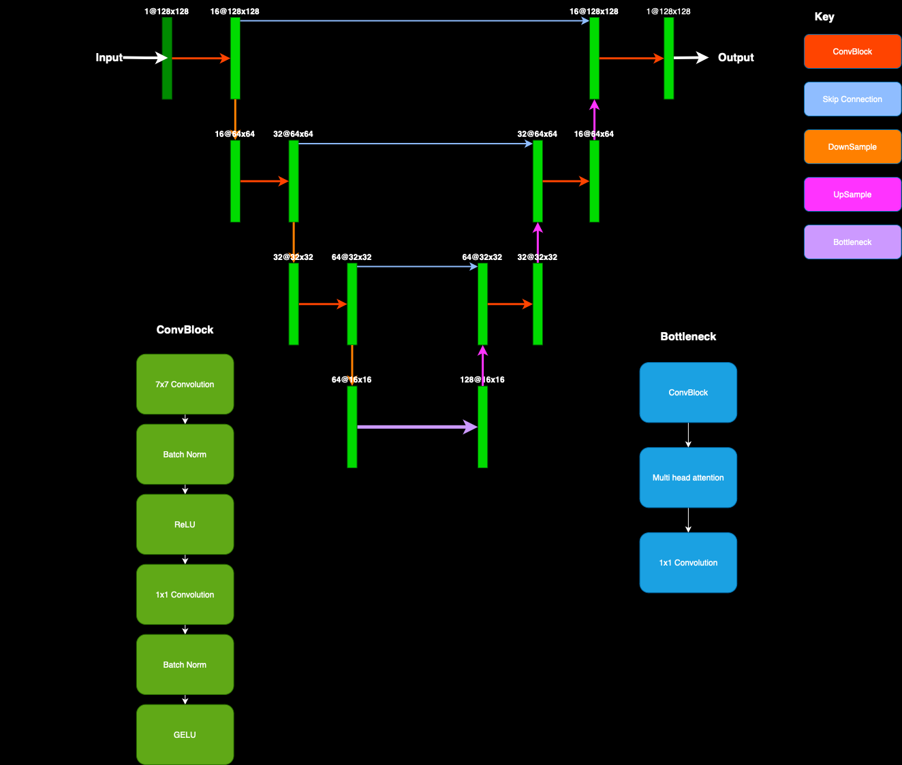

## Diffusion models for wildfire forecasting


[](https://github.com/ese-msc-2023/irp-cro23/tree/main/deliverables/FireDiff/LICENCE)


<!-- PROJECT LOGO -->

<br />
<p align="center">
  <a href="https://github.com/ese-msc-2023/irp-cro23">
    
  </a>

<p align="center">
    <br />
    <a href="https://github.com/ese-msc-2023/irp-cro23/blob/main/deliverables/FireDiff/docs/firediff.pdf"><strong>Explore the documentation»</strong></a>
    <br />
    <br />
  </p>
</p>

<!-- TABLE OF CONTENTS -->

<details open="open">
  <summary>Table of Contents</summary>
  <ol>
    <li>
      <a href="#about-the-project">About The Project</a>
    </li>
    <li>
      <a href="#getting-started">Getting Started</a>
      <ul>
        <li><a href="#prerequisites">Prerequisites</a></li>
        <li><a href="#installation">Installation</a></li>
      </ul>
    </li>
    <li><a href="#usage">Usage</a></li>
    <li><a href="#license">License</a></li>
    <li><a href="#contact">Contact</a></li>
    <li><a href="#acknowledgements">Acknowledgements</a></li>
  </ol>
</details>

<!-- ABOUT THE PROJECT -->

## About The Project

This project contains a library for a diffusion model designed to forecast wildfire progression. Code was built for an Msc thesis at the Imperial College London.

<!-- GETTING STARTED -->

Below is a short description of folders two layers deep. Please look inside of folders to see actual built python files and notebooks, each of which contain docstrings at the top:

```
.
├── fireDiff
│   ├── models           # Model architecture and container classes
│   ├── datasets         # Dataset classes 
│   ├── utils            # Utility functions
├── docs
│   └── source           # Documentation generated by sphinx
├── notebooks            # Example notebooks
│   └── data_recon       
└── tests                # Package tests
    └── data             # Test utility function
```


## Prerequisites

* Python 3.8
* Pytorch and other packages in ```requirements.txt```

## Installation

Follow these steps to install:

1. ```git clone https://github.com/ese-msc-2023/irp-cro23/tree/main/```
2. ```cd ./FireDiffusion```
3. ```pip install -r requirements.txt```
4. ```pip install -e .```

<!-- Weights -->
Pretrained models are available for any member of Imperial College at 
https://imperiallondon-my.sharepoint.com/:u:/r/personal/cro23_ic_ac_uk/Documents/Models.zip?csf=1&web=1&e=qpMltE

<!-- Datasets -->
Datasets are available on request


<!-- USAGE EXAMPLES -->

## Getting Started

In a python file, import the following to use all of the functionality:

```python
import fireDiff
```

Training a model for diffusion:

```python
from fireDiff.Models import UNet
from fireDiff.Models import DiffusionModel
from fireDiff.Datasets import VideoFramePairsDataset
import torchvision.transforms as transforms
from torch.utils.data import DataLoader
import torch


transform = transforms.Compose([
    transforms.ToPILImage(),
    transforms.Resize((128, 128)),
    transforms.ToTensor(),
    transforms.Normalize(mean=0.5, std=0.5)
])

num_epochs = ...  # Recommended minimum number of epochs for trainings


dataset = VideoFramePairsDataset(..., transform=transform) #training data should be in mp4 videos
dataloader = DataLoader(dataset, batch_size=64, shuffle=True)

device = torch.device("cuda" if torch.cuda.is_available() else "cpu")

unet = UNet()
model = DiffusionModel(unet, device=device)

model.train_diffusion_model(dataloader, epochs=num_epochs)
model.save_model(f"./Diffusion_{num_epochs}.pt")

```

Training a model for prediction.

```python
from fireDiff.Models import PredictionModel
from fireDiff.Models import PredictorUNet
from fireDiff.Datasets import VideoFramePairsDataset
import torchvision.transforms as transforms
from torch.utils.data import DataLoader
import torch

transform = transforms.Compose([
    transforms.ToPILImage(),
    transforms.Resize((128, 128)),
    transforms.ToTensor(),
    transforms.Normalize(mean=0.5, std=0.5)
])

num_epochs = ..  # Recommended minimum number of epochs for training


train_dataset = VideoFramePairsDataset(..., transform=transform)
train_dataloader = DataLoader(train_dataset, batch_size=64, shuffle=True)

val_dataset = VideoFramePairsDataset(..., transform=transform)
val_dataloader = DataLoader(val_dataset, batch_size=64, shuffle=True)

device = torch.device("cuda" if torch.cuda.is_available() else "cpu")

unet = PredictorUNet()
model = PredictionModel(unet, device=device)

model.train_model(train_dataloader, val_dataloader, epochs=1)
model.save_model(f"./predictor_{num_epochs}.pt")
```


To generate a sample based on an input image

```python
from fireDiff.Models import UNet
from fireDiff.Models import DiffusionModel
from fireDiff.Datasets import VideoFramePairsDataset
from fireDiff.Utils import threshold
import torchvision.transforms as transforms
from torch.utils.data import DataLoader
import torch
import matplotlib.pyplot as plt

transform = transforms.Compose([
    transforms.ToPILImage(),
    transforms.Resize((128, 128)),
    transforms.ToTensor(),
    transforms.Normalize(mean=0.5, std=0.5)
])

num_epochs = ...  # Recommended minimum number of epochs for trainings


dataset = VideoFramePairsDataset(..., transform=transform) #training data should be in mp4 videos
dataloader = DataLoader(dataset, batch_size=64, shuffle=True)

device = torch.device("cuda" if torch.cuda.is_available() else "cpu")

unet = UNet()
model = DiffusionModel(unet, device=device)
model.load(...)

prediction = model.diffusion_sampler(dataset[0][0].unsqueeze(0))
prediction = threshold(prediction)
plt.imshow(prediction.squeeze().detach().numpy())
```


These notebooks can also be found under examples in this repository
<!-- ACKNOWLEDGEMENTS 
_For more information, please refer to the report in this repo_
-->
<!-- LICENSE -->


## License

Distributed under the MIT License. See `LICENSE` for more information.

<!-- CONTACT -->


## Contact

* Christopher Ondrusz condrusz@gmail.com

<!-- ACKNOWLEDGEMENTS -->

## Acknowledgements

* Dr Sibo Cheng
* Dr Rosella Arcucci
* Royal School of Mines, Imperial College London

